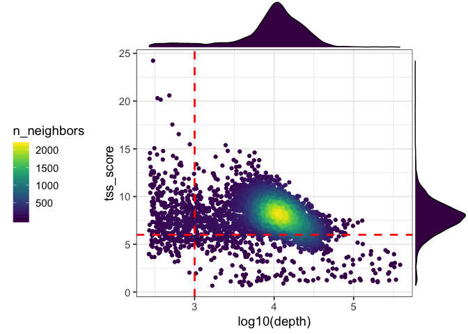
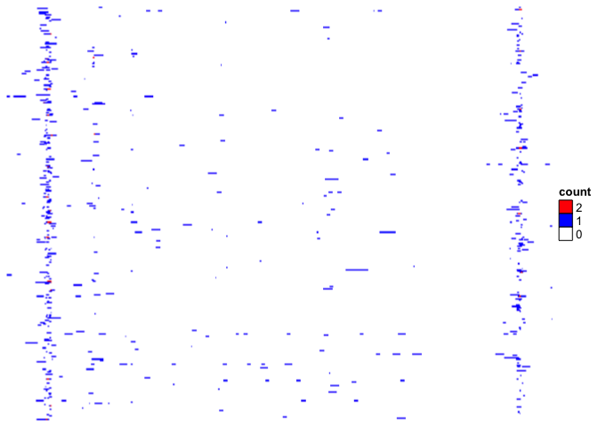

<!-- README.md is generated from README.Rmd. Please edit that file -->

# scATACutils: an R/Bioconductor package for working with 10x scATACseq data

<!-- badges: start -->

<!-- badges: end -->

The goal of scATACutils is to provide functions to work with 10x
scATACseq data. It includes functions to calculate qualtiy control
metrics such as banding score, Frip score, and TSS enrichment score etc.
Some convinient functions are provided for visulizations as well. Plot
the scatter plot of the Frip and read depth. Plot scATACseq coverage
tracks by group etc.

## Installation

You can install the released version of scATACutils from github with:

``` r
devtools::install_github("crazyhottommy/scATACutils")
```

## Example

Demonstration of some useful functions

Download the public 5k pbmc data at
<https://support.10xgenomics.com/single-cell-atac/datasets/1.1.0/atac_pbmc_5k_v1>

``` r
library(scATACutils)
library(dplyr)
library(readr)
library(ggplot2)


## this takes 5 mins
#frip<- CalculateFripScore("~/5k_pbmc_atac/fragments.tsv.gz",
#                          "~/5k_pbmc_atac/peaks.bed")

frip<- read_tsv("~/5k_pbmc_atac/frip.txt", col_names = T)

# a tibble with 3 columns, cell-barcode, depth and a Frip score
head(frip)
#> # A tibble: 6 x 3
#>   cells              depth  FRIP
#>   <chr>              <dbl> <dbl>
#> 1 AAACGAAAGAAAGCAG-1   283 0.113
#> 2 AAACGAAAGAAATACC-1     9 0.222
#> 3 AAACGAAAGAAATCTG-1     2 1    
#> 4 AAACGAAAGAACAGGA-1     5 0.8  
#> 5 AAACGAAAGAACCATA-1     1 1    
#> 6 AAACGAAAGAACGACC-1     3 0.333

## read in 5k pbmc atac data valid barcdoe
barcodes<- read_tsv("~/5k_pbmc_atac/pbmc_5k_atac_barcodes.tsv", col_names = F)

# the insert size distribution from https://github.com/crazyhottommy/scATACtools/blob/master/python/get_insert_size_distribution_per_cell.py

insert<- read_tsv("~/5k_pbmc_atac/pbmc_5k_insert_size.txt", col_names = T)

head(insert)
#> # A tibble: 6 x 3
#>   cell               insert_size read_count
#>   <chr>                    <dbl>      <dbl>
#> 1 TCACTCGAGTTCAAGA-1         231         82
#> 2 TCACTCGAGTTCAAGA-1          62        179
#> 3 TCACTCGAGTTCAAGA-1         273         51
#> 4 TCACTCGAGTTCAAGA-1          76        274
#> 5 TCACTCGAGTTCAAGA-1          56        228
#> 6 TCACTCGAGTTCAAGA-1         178        102

## this takes ~5mins
banding<- CalculateBandingScore(insert, barcodeList = NULL)

## distribution of the banding score after log10 transformation
ggplot(banding, aes(sample = log10(banding_score))) + 
  stat_qq() + 
  stat_qq_line(color = "red") +
  theme_bw(base_size = 14)
```


#### TSS enrichment score

This can take ~2hours using 10 CPUs for 5000 cells.

``` r
library(TxDb.Hsapiens.UCSC.hg19.knownGene)

tss_scores<- TssEnrichmentFromFrags("~/5k_pbmc_atac/fragments.tsv.gz",
                                    txs = TxDb.Hsapiens.UCSC.hg19.knownGene,
                                    workers = 10,
                                    barcodeList = barcodes$X1)
```

### depth vs Frip and TSS score

read in a pre-computed tss score for the 5k pbmc atac dataset.

``` r
tss_scores<- readRDS("~/5k_pbmc_atac/5k_pbmc_atac_tss_scores.rds")
head(tss_scores)
#>                                 cells tss_score
#> AAACGAAAGCGCAATG-1 AAACGAAAGCGCAATG-1  8.915011
#> AAACGAAAGGGTATCG-1 AAACGAAAGGGTATCG-1  7.974064
#> AAACGAAAGTAACATG-1 AAACGAAAGTAACATG-1  6.430791
#> AAACGAAAGTTACACC-1 AAACGAAAGTTACACC-1  6.316003
#> AAACGAACAGAGATGC-1 AAACGAACAGAGATGC-1  8.408465
#> AAACGAACATGCTATG-1 AAACGAACATGCTATG-1  8.907742
head(frip)
#> # A tibble: 6 x 3
#>   cells              depth  FRIP
#>   <chr>              <dbl> <dbl>
#> 1 AAACGAAAGAAAGCAG-1   283 0.113
#> 2 AAACGAAAGAAATACC-1     9 0.222
#> 3 AAACGAAAGAAATCTG-1     2 1    
#> 4 AAACGAAAGAACAGGA-1     5 0.8  
#> 5 AAACGAAAGAACCATA-1     1 1    
#> 6 AAACGAAAGAACGACC-1     3 0.333

frip_tss<- inner_join(frip, tss_scores)
#> Warning: Column `cells` joining character vector and factor, coercing into
#> character vector

head(frip_tss)
#> # A tibble: 6 x 4
#>   cells              depth  FRIP tss_score
#>   <chr>              <dbl> <dbl>     <dbl>
#> 1 AAACGAAAGCGCAATG-1 15317 0.834      8.92
#> 2 AAACGAAAGGGTATCG-1 17316 0.836      7.97
#> 3 AAACGAAAGTAACATG-1 25087 0.830      6.43
#> 4 AAACGAAAGTTACACC-1 22561 0.836      6.32
#> 5 AAACGAACAGAGATGC-1  8119 0.836      8.41
#> 6 AAACGAACATGCTATG-1  5261 0.735      8.91
```

TSS score

``` r

PlotScatter(frip_tss, y = "tss_score", vline = 3, hline = 6)
```



### Plot PC correlation with the sequencing depth

It is known that the first PC is correlated with the sequencing depth,
and it is usually discarded for downstream clustering. Let’s check that.

Also see [Assessment of computational methods for the analysis of
single-cell ATAC-seq
data](https://www.biorxiv.org/content/10.1101/739011v1) for discussing
this as well.

``` r
library(Seurat)
#> Warning: package 'Seurat' was built under R version 3.5.2

peaks <- Read10X_h5(filename = "~/5k_pbmc_atac/atac_pbmc_5k_v1_filtered_peak_bc_matrix.h5")

# binarize the matrix
# peaks@x[peaks@x >0]<- 1 

## create a seurat object
pbmc_seurat <- CreateSeuratObject(counts = peaks, assay = 'ATAC', project = '5k_pbmc')

pbmc_seurat@meta.data %>% head()
#>                    orig.ident nCount_ATAC nFeature_ATAC
#> AAACGAAAGACACTTC-1    5k_pbmc        9104          3845
#> AAACGAAAGCATACCT-1    5k_pbmc       14701          6127
#> AAACGAAAGCGCGTTC-1    5k_pbmc        7139          3345
#> AAACGAAAGGAAGACA-1    5k_pbmc       10148          4295
#> AAACGAACAGGCATCC-1    5k_pbmc       10704          4754
#> AAACGAAGTTTGTCTT-1    5k_pbmc        9538          4219

## do TF-IDF transformation and run PCA for dimension reduction/Latent Semantic Index
pbmc_seurat<- RunLSI(pbmc_seurat, n = 50)

## convert to SingleCellExperiment
pbmc_se<- as.SingleCellExperiment(pbmc_seurat)

PlotPCcorrelation(pbmc_seurat, reduction = "lsi")
```


Note the name of the reduction is different for SingleCellExperiment
object.

``` r
PlotPCcorrelation(pbmc_se, reduction = "LSI")
```


### Plot ATACseq tracks for each cluster of cells

More examples can be found at
<https://rpubs.com/crazyhottommy/scATAC_tracks>

``` r
library(TxDb.Hsapiens.UCSC.hg19.knownGene)
library(org.Hs.eg.db)

PlotCoverageByGroup(gene_name = "MS4A1", downstream = 8000, 
                    yaxis_cex = 1,fragment = "~/5k_pbmc_atac/atac_viz/10k_pbmc/atac_v1_pbmc_10k_fragments.tsv.gz",
                     grouping = "~/5k_pbmc_atac/atac_viz/grouping.txt", tick_label_cex = 1, tick.dist = 5000,
                     track_col = "red", 
                     label_cex = 1,
                     minor.tick.dist = 1000, label.margin = -0.6)
```


### plot raw signal for each cell

``` r

barcodes<- read_tsv("~/5k_pbmc_atac/pbmc_5k_atac_barcodes.tsv", col_names = FALSE)
#> Parsed with column specification:
#> cols(
#>   X1 = col_character()
#> )

p<- PlotCoverageByCell(gene_name = "MS4A1",
                   upstream = 2000, 
                   downstream = 8000,
                   fragment= "~/5k_pbmc_atac/fragments.tsv.gz",
                   barcodeList=barcodes$X1,
                   genome = "hg19", 
                   txdb = TxDb.Hsapiens.UCSC.hg19.knownGene,
                   eg.db = org.Hs.eg.db, cutSite = FALSE,
                   col_fun = c("white", "blue","red"))
#> 'select()' returned 1:1 mapping between keys and columns

p
```



You might want to concatenate the raw signal with the coverage plot by
celltype using `inkscape` or `adobe illustrator`. It is possible to
export the karyplot object as a grob and combine with the ComplexHeatmap
object using grid (see
<https://github.com/bernatgel/karyoploteR/issues/51>). Currently, it is
not implemented.

### Transcription factor motif footprint

``` r
library(BSgenome.Hsapiens.UCSC.hg19)
#> Loading required package: BSgenome
#> Loading required package: Biostrings
#> Loading required package: XVector
#> 
#> Attaching package: 'Biostrings'
#> The following object is masked from 'package:base':
#> 
#>     strsplit
#> Loading required package: rtracklayer
library(TFBSTools)
#> 
library(motifmatchr)
library(JASPAR2018)
library(rtracklayer)
library(EnrichedHeatmap)
#> Loading required package: grid
#> Loading required package: ComplexHeatmap
#> ========================================
#> ComplexHeatmap version 2.1.0
#> Bioconductor page: http://bioconductor.org/packages/ComplexHeatmap/
#> Github page: https://github.com/jokergoo/ComplexHeatmap
#> Documentation: http://jokergoo.github.io/ComplexHeatmap-reference
#> 
#> If you use it in published research, please cite:
#> Gu, Z. Complex heatmaps reveal patterns and correlations in multidimensional 
#>   genomic data. Bioinformatics 2016.
#> ========================================
#> ========================================
#> EnrichedHeatmap version 1.15.0
#> Bioconductor page: http://bioconductor.org/packages/EnrichedHeatmap/
#> Github page: https://github.com/jokergoo/EnrichedHeatmap
#> Documentation: http://bioconductor.org/packages/EnrichedHeatmap/
#> 
#> If you use it in published research, please cite:
#> Gu, Z. EnrichedHeatmap: an R/Bioconductor package for comprehensive 
#> visualization of genomic signal associations. BMC Genomics 2018.
#> ========================================

opts<- list()
opts[["species"]] <- "Homo sapiens"
## let's plot GATA2 motif footprint
opts[["name"]] <- "GATA2"
opts[["type"]] <- "ChIP-seq"
opts[["all_versions"]] <- TRUE
PFMatrixList <- getMatrixSet(JASPAR2018, opts)

PFMatrix<- PFMatrixList[[1]]
PWM <- toPWM(PFMatrix, pseudocounts = 0.8)

peaks<- import("~/5k_pbmc_atac/peaks.bed")
```

For footprint, it is important to read the fragments as cut sites,
otherwise you will not observe a dip in the motif where TF binds and
protects DNA from being
cut.

``` r
insertions<- ReadFragments("~/5k_pbmc_atac/fragments.tsv.gz", cutSite = TRUE)
cvg<- GenomicRanges::coverage(insertions)

plots<- PlotMotifFootPrint(PWM = PWM, peaks = peaks, cvg = cvg, extend = 100)
plots$heatmap
```


``` r
plots$lineplot
```


**correct for cutting bias** Tn5 has a cutting bias. For more
sophisticated bias correcting methods,
    check:

  - [seqOutBias](https://guertinlab.github.io/seqOutBias_Vignette/part3.html)

  - [HINT-ATAC](https://genomebiology.biomedcentral.com/articles/10.1186/s13059-019-1642-2)

  - [FootprintPipeline](https://github.com/aslihankarabacak/FootprintPipeline/)
    [paper](https://genomebiology.biomedcentral.com/articles/10.1186/s13059-019-1654-y)

### MAESTRO

many of the functions are being integrated to our
[MAESTRO](https://github.com/liulab-dfci/MAESTRO) single-cell RNAseq and
ATACseq analysis pipeline developed in Shirley Liu’s lab. That being
said, I plan to implement more new features in `MAESTRO` and will leave
`scATACutils` relatively quiet :).

## Acknowlegements

  - Thanks [Caleb](https://github.com/caleblareau) for sharing the FRIP
    score code.
  - Thanks [Ansu Satpathy](https://twitter.com/Satpathology) and
    [Jeffrey Granja](https://github.com/jeffmgranja) for sharing the TSS
    enrichment score codes. More details can be found at my blog post
    <https://divingintogeneticsandgenomics.rbind.io/post/calculate-scatacseq-tss-enrichment-score/>
    I referenced them in the source code.
  - The plotting track function is inspired by a post by Andrew Hill
    <http://andrewjohnhill.com/blog/2019/04/12/streamlining-scatac-seq-visualization-and-analysis/>
    and re-implemented using the
    [karyoploteR](http://bioconductor.org/packages/release/bioc/html/karyoploteR.html).
  - Check [Signac](https://satijalab.org/signac/) by Tim Sturt for
    similar functionalities.
